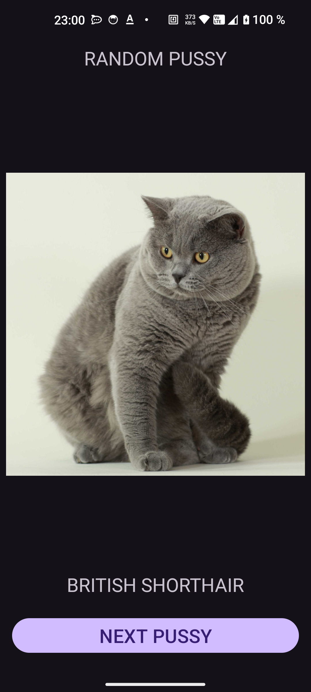
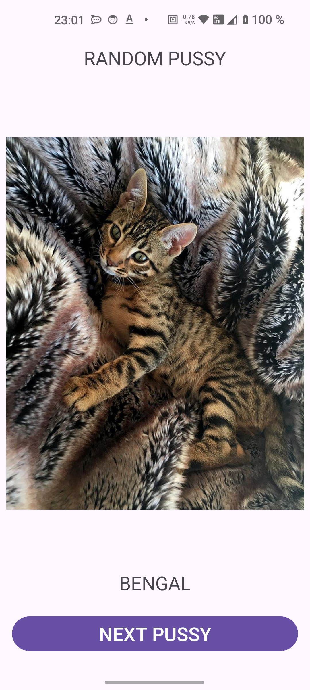

# Random Pussy App

Random Pussy App — это Android-приложение, которое загружает случайные изображения кошек и информацию о породах с помощью API **TheCatAPI**. Приложение использует архитектуру MVVM и популярные библиотеки, такие как Retrofit и Coroutines.

## Основные функции
- Загрузка случайных изображений кошечек
- Отображение названия породы
- Обработка ошибок и отображение сообщений
- Асинхронная загрузка данных с использованием корутин

## Используемые технологии
- **Kotlin** — основной язык разработки
- **Retrofit** — для взаимодействия с API
- **Gson** — для парсинга JSON
- **Coil** — для загрузки изображений
- **Coroutines** — для асинхронной обработки данных
- **LiveData** — для наблюдения за изменениями данных
- **ViewModel** — для разделения логики и UI

## Скриншоты

